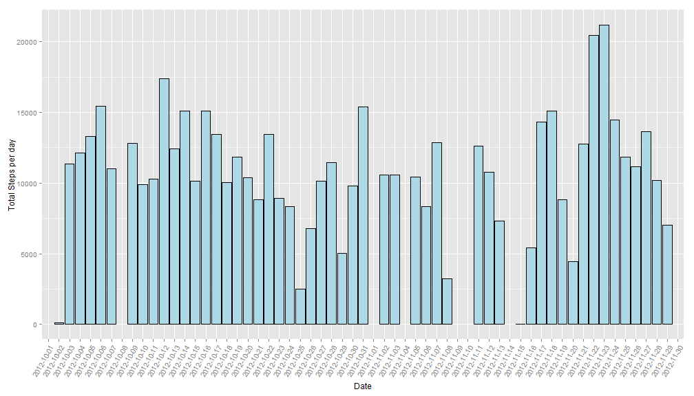
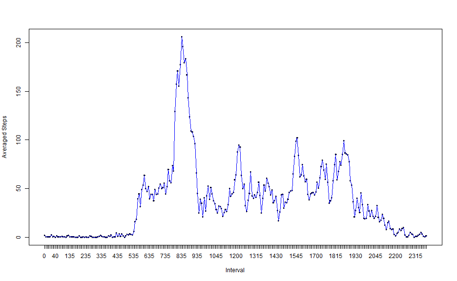
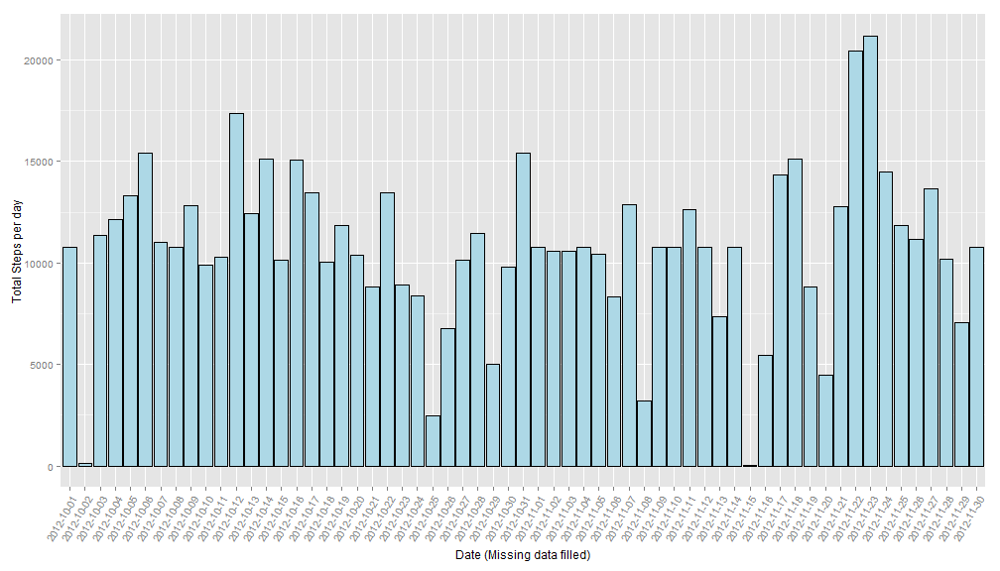

#### Special Note: As we could notice there's post in discussion forum of this course about [Make a Histogram.not a Bar](https://class.coursera.org/repdata-010/forum/thread?thread_id=9). I'm sure there are different thoughts on this, so I listed both kind of histogram plot from Base Graphic system(histogram, not bar) and ggplot2 system (in which geom_histogram is same as geom_bar).
## Loading and preprocessing the data
### 1. Load the data (unzip the original zip file and get activity.csv)

```r
data<-read.csv("activity.csv")
#Set Locale thus date column could be judged by weekday name.
Sys.setlocale('LC_ALL','English')
```
### 2. Process/transform the data into a format suitable for analysis.


```r
# convert column "interval" into factor:
data <- transform(data, interval = factor(interval)) 
```
## What is mean total number of steps taken per day
### 1.Make a histogram of the total number of steps taken each day

```r
# get an array StepSumPerDay with total number of steps per day
StepSumPerDay <- tapply(data$steps, data$date, FUN = sum)
hist(StepSumPerDay,breaks=20,col = "blue",main="Histogram of total number of steps per day",xlab="Total number of Steps per day(steps)",ylab="Frequency (days)")
```

 

###For Detailed steps per day distribution, see another histogram plot from ggplot2 below

```r
#Remove warning message when plotting with missing value
options(warn=-1)
#install.packages("ggplot2")
library(ggplot2)
# Since array StepSumPerDay contain both date string as its name and total number of steps per day, so create a new data frame newDF to contain both date and steps as two variables.
newDF<-data.frame(date=names(StepSumPerDay), stepSum=StepSumPerDay)
ggplot(newDF,aes(x=date,y=stepSum))+
        geom_histogram(stat='identity', fill="lightblue", colour="black")+
        theme(axis.text.x = element_text(angle=60, hjust=1)) +
        labs(x = expression("Date"))  + 
        labs(y = "Total Steps per day")
```

 

### 2.Calculate and report the mean and median total number of steps taken per day

```r
summary(StepSumPerDay,rm.na=T)
```

```r
summary(StepSumPerDay,rm.na=T)[3]
```

```
## Median 
##  10760
```

```r
summary(StepSumPerDay,rm.na=T)[4]
```

```
##  Mean 
## 10770
```

## What is the average daily activity pattern?
### 1.Make a time series plot (i.e. type = "l") of the 5-minute interval (x-axis) and the average number of steps taken, averaged across all days (y-axis)

```r
#install.packages("plyr")
library(plyr)
# Create a new data frame StepsPerInterveal to get the mean value of steps based on variable interval across all days.
StepsPerInterveal<-ddply(data, c("interval"),summarize, StepMean=mean(steps,na.rm = TRUE))
# Base graphic system
with(StepsPerInterveal, plot(interval, StepMean,type="l",xlab = "Interval",ylab="Averaged Steps",col="blue")) 
lines(StepsPerInterveal$interval, StepsPerInterveal$StepMean,type="l",xlab = "Interval",ylab="Averaged Steps",col="blue")
```

 

### 2. Which 5-minute interval, on average across all the days in the dataset, contains the maximum number of steps?
###Calculate the maxium number of steps:

```r
# get the maxium value row position
maxPosition<-which.max(StepsPerInterveal$StepMean)
# get the maxium stepMean value and its interval value
StepsPerInterveal[maxPosition,]
```

```
##     interval StepMean
## 104      835 206.1698
```
#### Base on the Calculated number and observed plot above, we can konw that the interval 835 (it's 8:35AM) has the maximum averaged number of steps each day.
  
  
## Imputing missing values
### 1.Calculate and report the total number of missing values in the dataset 


```r
#Get the NA total number
NAsum<-sum(is.na(data$steps))
```
####The total number of missing values is: 2304

### 2.Devise a strategy for filling in all of the missing values in the dataset.The strategy does not need to be sophisticated. For example, you could use the mean/median for that day, or the mean for that 5-minute interval, etc.
#### Here, we use the mean value for that 5-minute interval to impute NAs.

### 3.Create a new dataset named dataNew that is equal to the original dataset but with the missing data filled in.

```r
dataNew<-data
dataNew$steps[is.na(dataNew$steps)]<- StepsPerInterveal$StepMean[match(dataNew$interval, StepsPerInterveal$interval)]
```

### 4.Make a histogram of the total number of steps taken each day and Calculate and report the mean and median total number of steps taken per day

```r
# get another array StepSumPerDayNew with total number of steps per day, after filling all NAs.
StepSumPerDayNew <- tapply(dataNew$steps, dataNew$date, FUN = sum)
#Histogram from base graphic system
hist(StepSumPerDayNew,breaks=20,col="green",main="Histogram of total number of steps per day(NA filled)",xlab="Total number of Steps per day(steps)",ylab="Frequency(days)")
```

 

###For Detailed steps per day distribution, see another histogram plot from ggplot2 below

```r
# Since array StepSumPerDayNew contain both date string as its name and total number of steps per day, so create a new data frame newDF to contain both date and steps as two variables.
newDF<-data.frame(date=names(StepSumPerDayNew), stepSum=StepSumPerDayNew)
ggplot(newDF,aes(x=date,y=stepSum))+
        geom_histogram(stat='identity', fill="lightblue", colour="black")+
        theme(axis.text.x = element_text(angle=60, hjust=1)) +
        labs(x = expression("Date (Missing data filled)"))  + 
        labs(y = "Total Steps per day")
```

 

### Calculate and report the mean and median total number of steps taken per day.

```r
summary(StepSumPerDayNew,rm.na=T)
```

```r
summary(StepSumPerDayNew,rm.na=T)[3]
```

```
## Median 
##  10770
```

```r
summary(StepSumPerDayNew,rm.na=T)[4]
```

```
##  Mean 
## 10770
```

###Answering the question: Do these values differ from the estimates from the first part of the assignment? What is the impact of imputing missing data on the estimates of the total daily number of steps?

####With filled missing value, we could find that the new Mean value of steps taken per day is same as the original one, while the Median is a little different (10770 vs 10760) but could be ignored. So the only impact of the filled missing data is days of some total steps has an unobvious increase, or the special day in which there are missing values get an unobvious increasing bar height in the plot, but they doesn't impact the data in whole.

  
## Are there differences in activity patterns between weekdays and weekends?
### 1. Create a new factor variable in the dataset with two levels-"weekday" and "weekend" indicating whether a given date is a weekday or weekend day.

```r
# convert column "date" into datetime format:
dataNew$date<-strptime(dataNew$date,"%Y-%m-%d") 
# Add a new variable(column) named day to contain two levels "weekday" and "weekend".
dataNew$day = ifelse(weekdays(dataNew$date) == "Saturday" | weekdays(dataNew$date) == "Sunday", "weekend", "weekday")
#Convert the new variable into factor class
dataNew <- transform(dataNew, day = factor(day))
```
### 2. Make a panel plot containing a time series plot (i.e. type = "l") of the 5-minute interval (x-axis) and the average number of steps taken, averaged across all weekday days or weekend days (y-axis).

```r
# Use Lattice graphic system, just for coherent with the original example.
library(lattice)
#get the dataset StepsPerIntervealDay with averaged steps value per interval, while containing both weekday and weekend mark in day variable.
StepsPerIntervealDay<-ddply(dataNew, c("interval","day"),summarize, StepMean=mean(steps,na.rm = TRUE))
#draw plot panel in whihc day as condition to split weekday and weekend into separated two plots.
xyplot(StepMean ~ interval | day , data = StepsPerIntervealDay, type="l",main="Averaged Steps on Weekday and Weekend ",ylab = "Averaged Steps", xlab = "Interval", scales=list(y=list(tick.number=15),x=list(tick.number=25,at = seq(1, 288, 15))), layout = c(1, 2))
```

 
